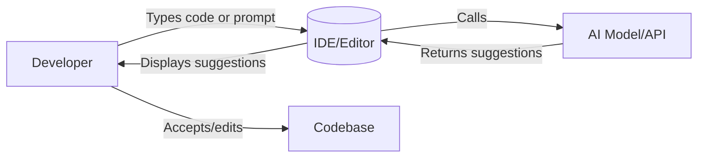

## Executive Summary

AI-powered code assistants are becoming essential tools for developers in 2026.  A recent Gartner report predicts **40% of enterprise applications** will embed AI agents by year-end, up from under 5% today【36†L26-L34】. Leading platforms like GitHub Copilot (20M+ users) and Amazon’s Q Developer (formerly CodeWhisperer) are seeing explosive growth【5†L134-L142】【36†L26-L34】. These assistants range from simple autocompletion to autonomous “agentic” bots that plan, code, and even commit changes.  In this guide, we survey the current landscape of AI coding assistants: adoption trends and benchmarks, comparisons of major tools, integration points, and key security and legal considerations.  We also offer practical recommendations for choosing and using AI coding tools safely and effectively in your projects.

## AI Code Assistants: Rising in Mainstream Use

AI assistants for coding have shifted from experimental add-ons to everyday developer tools.  In mid-2025, GitHub Copilot surpassed **20 million all-time users**【5†L134-L142】, and **90% of Fortune 100** companies use it in some capacity【5†L145-L154】.  Independent surveys confirm these tools are now *mainstream*: for example, the 2025 Stack Overflow Developer Survey found that a large majority of developers have tried AI coding assistants【38†L69-L75】. Industry reports estimate the AI coding market at several billion dollars, and growth forecasts remain very high. Gartner projects that by 2026, roughly **40% of enterprise apps** will include task-specific AI agents【36†L26-L34】, signalling that “agentic” AI (which can perform multi-step tasks autonomously) will become common in software workflows.

AI coding assistants today fall into two main categories:
- **IDE-based assistants:** Plugins or built-in tools (e.g. Copilot in VS Code, Tabnine, Cursor) that provide inline code completions, documentation lookup, and “chat” help as developers write code.
- **AI agents or CLI tools:** Standalone agents (e.g. Claude Code, GitHub Copilot CLI/Cloud Agent) that can run in the terminal, scan a project, make pull requests, or automate tasks end-to-end.

Most developers now use **multiple AI tools** to fit different needs【38†L69-L75】. For example, an IDE extension (like Copilot or Cursor) for day-to-day editing, combined with a terminal agent (like Claude Code) for large refactors or security audits.

### Adoption and Growth

Key adoption statistics highlight this trend:
- **85% of organizations** already use AI in some development capacity【33†L293-L300】, and 81% of developers express security or privacy concerns when using AI assistants【34†L562-L570】 (we discuss these risks later). 
- GitHub CEO Satya Nadella noted Copilot’s user base is growing rapidly, with 5 million new users in just 3 months in 2025【5†L134-L142】. 
- Smaller tools are also scaling fast: for example, Cursor reported going from \$100M to \$1B ARR in late 2025, and has over 1 million daily users【5†L166-L172】【38†L149-L156】.
- Stack Overflow and JetBrains surveys find younger and full-stack developers are especially quick to adopt coding AI, with usage rates over 50% in some segments【34†L635-L644】.

These numbers show AI coding assistants are no longer a niche. The performance improvements they offer—speeding up writing boilerplate, catching errors, suggesting best practices—are driving their uptake. At the same time, tools keep adding features: chat interfaces, pull-request summaries, code review suggestions, and even integrations with cloud services.  

【30†embed_image】 *Figure: Developers using an AI assistant within their IDE can get real-time code suggestions and documentation. (Image: Rawpixel.com/Pexels)*

## How AI Coding Assistants Work

At a high level, an AI code assistant takes your current code context (file contents, comments, open files) and uses a large language model (LLM) to generate suggestions. The workflow looks roughly like this:

The assistant’s LLM (from OpenAI, Anthropic, Google, etc.) has been trained on vast code and text corpora. It predicts likely completions, rewrites code, or answers code-related queries.  More advanced **agentic features** (e.g. Copilot’s cloud agent, Claude Code’s multi-step planning) allow the AI to operate semi-independently: they can scan an entire repository, generate an implementation plan (like “refactor this function”), open pull requests, and even run tests or deployments【9†L589-L597】【5†L174-L183】. 

Popular AI code tools bundle these capabilities differently:
- **Autocomplete/chat:** Most assistants offer real-time code completions (like IntelliSense on steroids) and a chat window. For example, Copilot and CodeWhisperer can suggest entire code blocks or explanations for code.
- **Context awareness:** They can ingest current files or project context. Claude Code boasts a 1-million-token window, meaning it can consider tens of thousands of lines at once【38†L114-L123】, while most others use shorter context.
- **Agents & CLI:** Tools like GitHub Copilot CLI or Amazon Q Developer (CodeWhisperer’s new branding) can run in a terminal. You instruct them in natural language (e.g. “Find and fix X bug”), they propose commits or branches, then you review.
- **Customization:** Many platforms allow *custom instructions* or *memories* (e.g. Copilot’s custom instructions, JARVIS memory) so you can “teach” the assistant project-specific facts or preferences.
- **Security checks:** Some assistants (notably AWS’s offering) embed security scanning. For instance, CodeWhisperer/Q Developer flags OWASP Top 10 vulnerabilities on-the-fly【13†L135-L142】【16†L233-L240】, whereas Copilot relies on developers to use separate tools.

Each model/API underpinning these tools has performance trade-offs (speed vs. correctness vs. hallucination risk). Benchmarks like SWE-bench (a coding task suite) are now common: for example, Anthropic’s Claude (via Claude Code) scores ~80% on SWE-bench【38†L69-L77】【38†L116-L124】, as does OpenAI’s latest GPT-5.4 model【38†L182-L189】. These high scores translate into assistants that can handle complex, multi-step coding tasks. However, no AI is flawless: developers must still validate and test any generated code.

## Comparing Major AI Coding Tools

There is a crowded market of AI coding assistants. Here are some leading examples and how they differ:

| Assistant        | Integration (IDE/CLI)                                 | Primary Focus                             | Pricing (approx)      |
|------------------|-------------------------------------------------------|-------------------------------------------|-----------------------|
| **GitHub Copilot** | VS Code, JetBrains, Neovim, CLI, GitHub UI            | General code completion & chat; broad language support【15†L155-L164】【16†L248-L256】 | $10/month personal; $19/month enterprise |
| **Amazon Q Developer** (CodeWhisperer) | VS Code, IntelliJ, AWS Console/CLI, SageMaker Studio   | AWS-centric coding (Lambda, S3, etc); built-in security & license scanning【13†L113-L122】【16†L233-L242】 | Free; Pro \$19/month (with advanced security & compliance) |
| **Cursor**        | Cursor IDE (VSCode fork), VS Code plugin, CLI         | AI-native IDE: fast autocomplete, multi-file editing, visual composer mode【38†L149-L156】【38†L164-L169】 | Free (basic); Pro $20/month; Business $40/month |
| **Claude Code**   | Terminal (CLI), GitHub repo integration                | Terminal-based agent: multi-file refactoring, PRs, parallel “agent teams”【38†L114-L123】 | \$20–200/month (depending on context size) |
| **Tabnine**       | VS Code, JetBrains, Sublime, CLI                        | Code completion powered by local/LLM models; privacy (local models available) | Free tier; pro plans from ~$49/user/month |
| **OpenAI ChatGPT/Codex** | Web chat, VS Code, CLI (Codex), API            | LLM-based assistant; strong reasoning; powers many tools (Codex, Copilot)【38†L182-L189】 | Free/Pro tiers; API pay-per-use |
| **Claude Chat/Code** | Anthropic’s Claude via web, or via tools like CodeSmith | Conversational coding, code analysis, LLM + long context | Depends on access (usually via platform pricing) |

Each tool has strengths. For example, **Copilot** excels at general-purpose coding and integrates with many IDEs, but it doesn’t include built-in vulnerability scanning【16†L233-L241】. **Amazon Q Developer** shines for AWS projects (it can even generate AWS CLI commands and analyze cloud resources【13†L125-L133】) and emphasizes security checks【16†L233-L240】. **Cursor** offers a rich GUI with multi-file changes and model switching【38†L149-L156】. **Claude Code** is powerful for large repos thanks to its 1M-token context【38†L114-L123】, but it’s terminal-only. 

The pricing also varies: Copilot has a low entry point (free for students, \$10-$19/mo)【16†L263-L271】, while enterprise-oriented tools like Claude Code or Q Developer Pro can cost \$100-\$200/mo for heavy use. Open-source or free options exist too (e.g. Codeium, local models like StarCoder/CodeGen via Tabnine/OpenCode). Ultimately, many teams mix and match: one report found developers typically use **2–3 tools** simultaneously, picking the best for each task【38†L69-L75】【6†L58-L60】.

【31†embed_image】 *Figure: A developer using an AI-powered tool on multiple monitors. AI assistants integrate into IDEs to autocomplete code, generate tests, or flag issues in real-time. (Image: Mikhail Nilov/Pexels)*

## Performance Benchmarks and Developer Feedback

Benchmarks help compare these AI assistants, but real-world performance can vary. Industry benchmarks like **SWE-bench** test coding tasks, and independent rankings (e.g. LogRocket’s) place Claude and Cursor at the top【38†L69-L77】. According to one testing series, Claude Code (Anthropic’s model) scored ~80.8% on coding tasks【38†L69-L77】, beating many competitors, while OpenAI’s GPT-5.4/Codex reached similar scores【38†L182-L189】. 

However, practical user studies show mixed results. For instance, one randomized trial found that **experienced developers** actually wrote code *slower* with AI assistance, despite feeling faster【34†L572-L579】. Conversely, vendor benchmarks often tout 2×–3× productivity gains. The reality is nuance: AI can speed up routine work but may introduce subtle bugs or require extra review time. Some highlights from recent research:
- **Code quality:** AI-generated code tends to have more duplication and fewer refactors. A GitClear study found developers using AI added 4× more duplicate code and did 60% fewer refactors by 2024【34†L536-L544】.
- **Defects:** An analysis of pull requests found code with AI contributions had ~2.7× more security vulnerabilities than human-only code【34†L551-L559】.
- **Perceptions:** 57% of organizations *think* AI tools introduce security risk, but 63% also see them as helping write more secure code【33†L316-L324】. Similarly, 81% of developers report privacy/security concerns about AI assistants【34†L562-L570】.

These mixed signals underline that while AI coding tools can boost speed, they are not substitutes for good practices. Always review AI suggestions, write tests, and use security scanners to catch what the model might miss.

## Integration and Pricing

Modern AI coding assistants plug into the tools developers already use. Most offer plugins for **popular IDEs and editors**:
- **Visual Studio Code:** Nearly every major assistant has a VS Code extension (Copilot, Q Developer, Tabnine, Codeium, etc.).
- **JetBrains IDEs:** Copilot, CodeWhisperer/Q Dev, Tabnine, and others work in IntelliJ, PyCharm, etc.
- **CLI/Terminal:** Copilot CLI, Claude Code, and CodeWhisperer can run in bash/zsh and operate on local repos.
- **Cloud Consoles:** AWS’s Q Developer is accessible via the AWS Console and Cloud9; GitHub Copilot features are on GitHub.com.
- **Chat Interfaces:** Some tools have standalone chatbots or Slack bots (e.g. Amazon Q “Copilot” chat, ChatGPT, Google’s AI chat in Cloud Shell).

Integration also extends to project and cloud context. For example, CodeWhisperer/Q Developer reads AWS account metadata and can embed AWS IAM credentials to fetch resource lists【13†L125-L133】. Copilot can tie into a repository’s issue tracker to open or close issues automatically. These deep integrations can save time (e.g. generating an AWS CLI command from natural language) but require correct permissions.

On pricing, there is wide variation:
- **Freemium models:** Copilot offers a free tier for verified students and a \$10–\$19/month plan for others. GitHub also bundles Copilot in some team subscriptions. Cursor has a limited free tier and \$20–\$40 plans【38†L153-L156】.
- **Subscription/Enterprise:** Many tools charge per-seat. Copilot Business is around \$19/user/month; AWS Q Developer Pro (with advanced security features) is \$19/user/month; Tabnine teams start at \$49/user/month.
- **Usage-based:** Some models (like OpenAI or Claude via API) are pay-per-call. For instance, GPT-5-based agents might cost hundreds per month for heavy use.
- **Open Source/Free:** Tools like Codeium or open LLMs (StarCoder, Llama-4 Maverick) offer free basic assistance if self-hosted or in limited form.

Teams should weigh cost against benefit: a tool that saves even a small fraction of developer time can justify its price, but ensure the tool covers the languages and workflows you need. Remember that adding AI doesn't automatically save money unless it truly replaces tedious work or catches costly errors.

## Security, Privacy, and IP Considerations

AI code assistants introduce new dimensions of risk. The **security** of generated code and the **privacy** of your codebase are top concerns:
- **Data privacy:** Most AI tools send your code context to external servers. 81% of developers worry about sensitive code or secrets being exposed【34†L562-L570】. Use work-provided tools and abide by data policies. Don’t paste proprietary code into public AI chatbots.
- **Vulnerabilities:** AI models can “hallucinate” insecure code. Studies show ~29% of Copilot-generated Python code contained potential security weaknesses【34†L562-L570】. In practice, many organizations see AI as both a risk and a help: 57% say AI can introduce new security issues, but 63% say it also helps catch bugs【33†L316-L324】. Always run static analysis and manual review on AI-suggested code.
- **License/IP:** Because models are trained on public code, there’s a risk of violating licenses (e.g. Apache, GPL). An AI agent might propose code copied from open-source without proper attribution. AWS’s tools mitigate this by flagging suggestions similar to known code snippets【16†L241-L249】, while Copilot currently leaves license compliance to the user. Black Duck research warns that **license compliance isn’t on many teams’ radar** despite being a scalable legal risk【33†L354-L363】. Organizations should consider tools or policies (like AI **Indemnity** plans) to manage this.

Key best practices from recent studies:
- **Monitor AI usage:** Companies that ignore unapproved AI use risk leakage of IP【33†L354-L363】. Track which tools team members use and what code is sent out. 
- **Balance risk and reward:** Define clear policies on AI in coding. For example, use AI for prototyping or generating boilerplate, but require peer review for any AI-generated critical logic【33†L369-L378】.
- **Leverage AI responsibly:** Use AI to *augment* your workflow. For instance, let the assistant write a first draft of a function, then refine it yourself. Employ the AI to suggest test cases or documentation, not just final code.
- **Keep humans in loop:** Despite agentic features, always approve changes. Use the review features built into tools (like Copilot’s PR suggestions) to check AI commits before merging【9†L589-L597】.

By acknowledging and mitigating these issues—through training, tools, and processes—teams can enjoy AI’s productivity gains while minimizing surprises.

## Best Practices and Recommendations

To get the most from AI code assistants in 2026:
- **Start small and measure:** Test a tool on a small project. Measure effects (time saved, code quality) before rolling out widely. Many teams use AI on non-critical modules first.
- **Mix and match tools:** Use the right assistant for each task. For example, use an IDE assistant for daily coding, a terminal agent for large refactors, and specialized cloud AI for infrastructure tasks.
- **Customize to your context:** Take advantage of customization features. Curate your own prompts or instruction files to focus the AI on your code style or patterns.
- **Train the team:** Ensure developers know how to prompt and review AI output effectively. Prompt engineering (giving clear instructions) is a skill. Also train on security: recognize when AI output looks suspicious (like exact copies of popular libraries).
- **Stay updated:** This field moves fast. Check official docs and release notes (Copilot now has chat and agent modes【9†L589-L597】, AWS’s Q Developer is evolving from CodeWhisperer, Google has its Gemini IDE features) to leverage new capabilities.

---

## Summary

AI coding assistants in 2026 are powerful new teammates for developers. Here are the takeaways:

- **Mainstream adoption:** 85% of organizations use AI dev tools, and leading tools have tens of millions of users【33†L293-L300】【5†L134-L142】. They’ll only become more integrated into development workflows.
- **Variety of tools:** GitHub Copilot, Amazon Q Developer, Cursor, Tabnine, Claude Code and others each serve different niches. Some focus on general coding; others specialize (e.g. AWS integration【13†L113-L122】 or large-scale refactoring【38†L114-L123】).
- **Benchmarks & usage:** Top models score ~80% on coding benchmarks【38†L69-L77】【38†L182-L189】. Developers often report faster prototyping, but must watch out for duplicated code and ensure thorough testing.
- **Security & IP:** The biggest risks are leaking private code and introducing insecure or license-problematic code【33†L354-L363】【34†L562-L570】. Use built-in security scans (e.g. OWASP checks) and code-review practices for AI output.
- **Integrate wisely:** Pay attention to IDE support and pricing. Manage access via company licenses and consider cost vs. benefit. Use AI agents for large tasks (e.g. “build a REST API”) but supervise their outputs.
- **Balance and oversight:** Monitor AI use in your projects, establish guidelines, and train teams on safe usage【33†L369-L378】.

As AI assistants continue evolving (with multimodal inputs, tighter IDE integration, etc.), developers who understand how to use them responsibly will gain a real productivity edge. The tools are already here – measure their impact, address their risks, and integrate them smoothly into your workflow for the greatest benefit.

---

## Content Tracking Log

| Title                                                              | Primary Keyword          |
|--------------------------------------------------------------------|--------------------------|
| Harnessing AI Code Assistants: Tools, Trends, and Best Practices   | AI code assistants       |