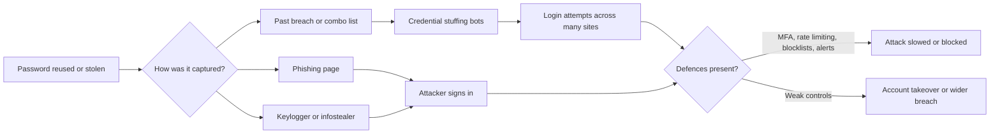
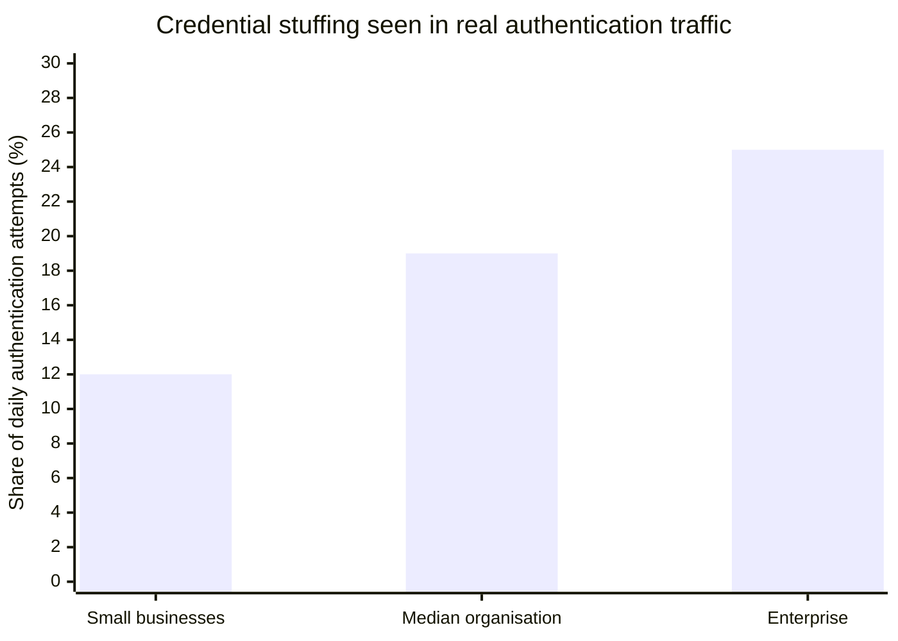

# How Hackers Crack Weak Passwords And How to Prevent It

## Executive summary

Most password compromises are boring rather than brilliant. Attackers usually win because a password is short, reused, exposed in an old breach, typed into a phishing page, or captured by malware. In entity["company","Verizon","telecom company"]’s additional 2025 DBIR research, compromised credentials were the initial access vector in 22% of breaches, and credential stuffing made up a median 19% of daily authentication attempts in SSO-provider logs, rising to 25% in enterprise-sized organisations. entity["company","Microsoft","technology company"]’s 2025 Digital Defense Report also says 97% of identity attacks it observed were password spray attacks, while its CISO executive summary says the company blocked roughly 11,000 password attacks per second over the year. citeturn24view2turn6view1turn6view2

Reuse is still a structural problem. Verizon found that for users whose systems were compromised by infostealers, only 49% of saved passwords were distinct across services. As of April 2026, entity["organization","Have I Been Pwned","breach notification service"] lists 975 loaded breaches and 17.53 billion pwned accounts, and its Pwned Passwords service now handles more than 18 billion password checks per month. citeturn24view2turn36view0turn23view2

That does not mean passwords are useless. It means you must treat them as one layer, not the whole wall. For everyday readers, the high-leverage answer is unique passwords, a password manager, MFA, and anti-phishing hygiene. For site owners, it is modern password policy, breached-password blocking, slow salted hashes, login throttling, generic error handling, and monitoring that makes abnormal sign-ins visible fast. citeturn26view0turn7view0turn8view0turn31view0turn12view0

Key takeaway: length matters against guessing, but it does not stop phishing or keyloggers. The entity["organization","National Institute of Standards and Technology","us standards body"] says passphrases are often an effective way to create longer passwords, yet it also notes that keystroke logging, phishing, and social engineering are just as effective against long complex passwords as against simple ones. citeturn33view0

## Why weak passwords still fail

Weak passwords fail in two different worlds. In the online world, an attacker tries guesses against a live login form and runs into rate limits, lockouts, CAPTCHAs, and MFA. In the offline world, an attacker steals password hashes from a breached database and tests guesses on their own hardware, without your website’s rate limits slowing them down. NIST says passwords that are too short yield to brute-force and dictionary attacks, and it notes that offline cracking becomes practical when attackers obtain hashes and can compute enormous numbers of guesses outside the application. citeturn33view0turn6view4

Modern guidance is much less obsessed with “must contain one symbol” rules than many older password policies still are. NIST now requires a minimum of 15 characters for password-only authentication, allows a minimum of 8 when the password is only one factor within MFA, recommends a maximum length of at least 64 characters, says printable characters and spaces should be accepted, says arbitrary composition rules should not be imposed, and says routine forced password changes should not be required unless there is evidence of compromise. It also requires checking new passwords against blocklists of common and compromised values, rate-limiting failed attempts, and allowing password managers and paste/autofill. citeturn6view3turn26view0turn26view3

The table below summarises the practical baseline that falls out of NIST and OWASP guidance for modern password handling. citeturn26view0turn26view3turn7view0turn9view3

| Control | Good baseline | Why it matters |
|---|---|---|
| Minimum length | **15+ characters** for password-only logins; **8+** only when the password is one factor inside MFA | Short secrets fall faster to brute-force and dictionary attacks |
| Maximum length | **At least 64 characters** | Lets users and managers create long passphrases and random strings |
| Allowed characters | Accept spaces, printable characters, and ideally Unicode | Prevents needless user workarounds and supports passphrases |
| Composition rules | Do **not** force arbitrary mixes of upper/lower/numbers/symbols | Users respond predictably with weak variants such as `Password1!` |
| Rotation | Change on **evidence of compromise**, not on a calendar | Periodic resets often create small, guessable mutations |
| Blocklist | Reject common, breached, and context-specific passwords | Stops top guesses before throttling limits are reached |
| Password-manager support | Allow paste, autofill, and standard form fields | Makes strong, unique passwords realistic in day-to-day use |
| Login defence | Rate-limit failures and step up on risk signals | Slows online guessing and surfaces abuse early |
| Storage | Use Argon2id or another adaptive password hash with unique salts | Makes offline cracking slower and more expensive |

## How attackers crack weak passwords

entity["organization","OWASP","appsec nonprofit"] separates live login abuse into brute force, credential stuffing, and password spraying. In real incidents, those categories overlap: phishing and keyloggers harvest the secrets, breach corpora turn them into combo lists, and offline cracking tests what still works after a database leak. citeturn6view5turn12view2turn31view0turn12view0

### Brute force

A brute-force attack is the broadest category: the attacker tries many candidate passwords until one works. OWASP describes it as testing multiple passwords from a dictionary or other source against a single account. NIST adds the crucial distinction that short passwords are especially vulnerable to brute-force and dictionary attacks, while stolen hashes open the door to much faster offline guessing. citeturn6view5turn33view0

For site owners, brute force often looks like repeated failures against one username, a spike in account lockouts, or bursts of requests that trigger throttling. OWASP recommends login throttling, account-based lockout or exponential backoff, and real-time logging of all failures and lockouts. It also says the failed-login counter should be tied to the account, not only the source IP, because attackers can rotate through many IP addresses. citeturn8view0turn22view2

### Dictionary attacks

A dictionary attack is not random guessing. It is targeted guessing based on how people really choose passwords: dictionary words, common names, keyboard walks, reused patterns, and weak “policy compliant” variants. NIST explicitly warns that composition rules often produce predictable outcomes such as `Password1!`, and it requires blocklists that include passwords from prior breach corpora, dictionary words, and context-specific words such as the service name or username. citeturn33view0turn26view2

The tell-tale pattern is not always raw volume. Sometimes it is a cluster of guesses built from the top 1,000 or 10,000 known weak passwords and tiny variations that just satisfy an outdated password policy. Good defence here is less about asking users for “special characters” and more about blocking known bad choices, showing a strength meter, and allowing long passphrases instead of forcing awkward complexity theatre. citeturn9view1turn33view0

### Credential stuffing

Credential stuffing uses real username-password pairs stolen from somewhere else. OWASP defines it as testing username/password pairs obtained from the breach of another site. This is why password reuse is so destructive: one breach becomes many downstream account takeovers. HIBP’s own breach pages and Pwned Passwords guidance explain the same chain, and Verizon’s 2025 research shows just how operational this is at scale. citeturn6view5turn18view0turn23view2turn24view2

For defenders, credential stuffing often hides inside normal authentication traffic because the attacker may only try each pair once and may spread traffic across proxy networks. OWASP recommends watching for sign-ins from a new browser, device or IP address, unusual countries, IPs attempting multiple accounts, and behaviour that appears scripted rather than human. It also recommends volume metrics and user notifications for unusual security events. A related technique, password spraying, flips the pattern around by trying one weak password across many accounts; Microsoft says 97% of identity attacks it observed were password spray attacks. citeturn29view1turn22view3turn29view0turn6view1

### Rainbow tables and offline hash cracking

A rainbow table is a precomputed lookup table of password hashes. It matters mainly when passwords are stored badly, especially without unique salts. OWASP says salts force attackers to crack each hash separately rather than hashing once and comparing across the whole database, and it explicitly notes that salting protects against precomputed rainbow tables and database-based lookup attacks. citeturn7view1turn7view4

That said, the bigger modern risk is broader offline cracking after a breach. OWASP warns that once attackers have stored password hashes, they are always able to brute-force them offline; defenders can only slow them down by using memory-hard or expensive password hashes. That is why modern password storage is about Argon2id, salts, and sometimes peppering for defence-in-depth, not about plain SHA-256, MD5, or reversible encryption. citeturn6view4turn7view0turn7view1turn7view2turn7view3

### Phishing

Phishing is social engineering: the attacker persuades the victim to hand over the password directly or click something that installs malware. The entity["organization","Federal Trade Commission","us consumer agency"] says scammers use email or text messages to steal passwords and other sensitive data, often by inventing urgent account problems, fake log-in alerts, billing issues, suspicious activity notices, or links to “update” details. The FTC also says legitimate companies will not email or text you a link asking you to update payment information. citeturn31view0

This matters because password strength alone does not help much once the user willingly types the password into the wrong box. If the message is unexpected, do not sign in through the link. Go to the service through a bookmark or a manually typed address you already trust, then check notifications there instead. MFA helps limit damage if a password is phished, but the stronger lesson is behavioural: a well-crafted phishing page does not care whether the password is `hello123` or a 30-character monster. citeturn31view0turn33view0

### Keyloggers

A keylogger is malware that secretly records what the user types. entity["company","Microsoft","technology company"] describes keyloggers as covert threats that silently record keystrokes to steal sensitive information, and says modern variants may also capture screenshots and clipboard data. Microsoft also notes that keyloggers are often delivered through phishing emails, fake software, or infected websites. citeturn12view0turn12view3

Keyloggers are dangerous because they make even a brand-new password unsafe if you type it on an infected device. In practice, the warning signs are often indirect: repeated account compromise from a device you use, suspicious downloads, endpoint alerts, or unexplained credential theft despite password resets. The right response starts with the device, not the account: update the system, run security tools, remove the malware, and only then rotate passwords and active sessions. citeturn12view0turn12view3

The table below turns the attack landscape into a practical cheat sheet for readers and webmasters. It synthesises NIST, OWASP, FTC and Microsoft guidance. citeturn33view0turn6view5turn29view1turn31view0turn12view0

| Attack | What the attacker relies on | What it usually looks like | Useful warning signs | Best countermeasures |
|---|---|---|---|---|
| Brute force | Lots of guesses against one account | Repeated login attempts until throttled or blocked | Many failures on one account, lockouts, throttling events | Long passwords, account-based throttling, MFA, logging |
| Dictionary attack | Human predictability | Guessing common words and weak variants | Recurring attempts with top-list passwords | Blocklists, strength meter, passphrases, no brittle composition rules |
| Credential stuffing | Reused credentials from another breach | One or a few tries per account across many users | New device/IP, strange country, same IP across many accounts, bot-like traffic | Unique passwords, MFA, breached-password checks, monitoring, device/IP intelligence |
| Rainbow/offline cracking | Poor password storage after a breach | Cracking happens away from the website | Often invisible until later abuse appears | Salts, Argon2id/scrypt/bcrypt, peppering, forced reset after a breach |
| Phishing | User trust and urgency | Fake login page, fake account alert, malicious attachment or link | Unexpected security warnings, generic greetings, “update now” links | MFA, link hygiene, training, known bookmarks, prompt scepticism |
| Keylogger | Malware on the victim’s device | Silent capture of keystrokes, screenshots, clipboard data | Endpoint alerts, suspicious downloads, repeated theft despite resets | Security software, software updates, safer downloads, MFA, clean device before password changes |

This flow shows why “make a stronger password” is only part of the story. citeturn6view5turn31view0turn6view4turn29view1



## What the data and breaches show

Official breach data shows why password hygiene is still worth an entire article. Verizon’s 2025 executive summary analysed 22,052 real-world security incidents and 12,195 confirmed breaches across 139 countries. Credential abuse remained the most common initial access vector, vulnerability exploitation climbed to 20%, and the human element still appeared in around 60% of breaches. Verizon also found substantial overlap between info-stealer logs and later ransomware victims, suggesting that credential theft is often the quiet prelude to a much louder incident. citeturn19view0turn20view0turn20view2

In 2023, entity["company","23andMe","genetics testing company"] said threat actors accessed a select number of accounts through credential stuffing because the usernames and passwords used on 23andMe were the same as credentials exposed on other sites. The company said roughly 14,000 accounts were directly accessed, but connected DNA Relatives and Family Tree features expanded the exposure to about 5.5 million and 1.4 million profiles respectively. 23andMe responded with mandatory password resets and later required two-step verification for all users. citeturn16view0

In 2024, entity["company","Mandiant","cybersecurity company"] reported that UNC5537 systematically compromised customer instances of entity["company","Snowflake","cloud data company"] using stolen customer credentials, often sourced from infostealer malware. In the incidents Mandiant responded to, the compromised accounts did not have MFA enabled; Mandiant and Snowflake notified about 165 potentially exposed organisations, and at least 79.7% of the accounts used by the actor had prior credential exposure. Some of the credentials dated back to 2020, showing how long stale passwords can remain dangerous if they are never rotated. citeturn16view1

At internet scale, combo lists keep the problem alive long after the original breach fades from the news. HIBP’s Collection #1 entry describes almost 2.7 billion records and 773 million unique email addresses paired with passwords from other breached services, exactly the sort of material used for credential stuffing. As of April 2026, HIBP’s breach directory shows 975 total breaches and 17.53 billion pwned accounts. citeturn18view0turn36view0

Verizon’s 2025 research gives a useful operational snapshot of credential stuffing in live traffic: a median 19% of daily authentication attempts, rising to 25% for enterprise organisations and sitting at 12% even for small businesses. That does not mean one in five attempts succeeds; it means one in five may be hostile enough to deserve design-level defences, not just reactive clean-up. citeturn24view2



## How to prevent weak-password compromise

Good password defence interrupts the attack chain at multiple points: stop weak passwords being chosen, stop stolen passwords being reused successfully, reduce the value of stolen hashes, and make suspicious sign-ins visible early. NIST and OWASP are remarkably consistent on this point: passwords still matter, but the strongest real-world results come from layers rather than from one “perfect” password rule. citeturn26view0turn22view3turn8view0

A password manager is no longer an optional “power user” extra. NIST says password managers increase the likelihood that users will choose stronger passwords, especially when the manager includes a generator, and both NIST and OWASP say verifiers should allow paste and autofill rather than breaking them. The comparison below is a practical framework rather than a product ranking. citeturn26view0turn9view0

| Password manager approach | Best for | Main strength | Main caution |
|---|---|---|---|
| Browser-integrated manager | People who need the lowest-friction start | Fast adoption and easy autofill | Fewer team, sharing, audit and recovery controls |
| Dedicated personal/family manager | Most households, freelancers and webmasters | Better generation, sync, sharing, alerts and recovery planning | Requires deliberate setup and MFA on the vault itself |
| Team/business vault | Agencies, site owners and shared admin environments | Role-based sharing, off-boarding and audit visibility | Adds admin work and process discipline |

### Numbered steps for users and site owners

1. **Use a password manager for every account you can.** Let it generate a unique secret per site so that one breach does not become five more. NIST explicitly says password managers improve the odds of stronger passwords, and HIBP’s entire model exists because reuse remains common. citeturn26view0turn23view2turn24view2

2. **For the few passwords you truly must remember, favour long passphrases over clever complexity tricks.** NIST says passphrases are often an effective way to create longer passwords, and length is the primary factor for password strength against guessing. A passphrase such as several unrelated words is usually easier to remember than an awkward symbol-heavy mutation. citeturn33view0

3. **Turn on MFA first on your email, password manager, admin panels, banking, and any account that can reset other accounts.** OWASP calls MFA the best defence against most password-related attacks, and the FTC notes that MFA makes it harder for scammers to access accounts even if they get your username and password. citeturn6view5turn8view0turn31view0

4. **Check old passwords against breached-password datasets and replace anything reused.** NIST requires blocklists of common and compromised passwords, and HIBP’s Pwned Passwords service exists specifically to help services and users avoid recycling exposed secrets. citeturn26view0turn6view6turn6view7

5. **Treat unexpected sign-in links, billing alerts, and “suspicious activity” messages as hostile until proven otherwise.** FTC guidance is blunt: scammers routinely invent urgency to get you to click a link or open an attachment. Go to the service through a known route, not the message. citeturn31view0

6. **If you suspect malware or a keylogger, fix the device before you change the password.** A keylogger can simply capture the replacement password as you type it. Update the OS and apps, run security tools, and only then rotate credentials and sessions. citeturn12view0turn12view3

7. **If you run a website, adopt a modern password policy instead of an old-school complexity checklist.** Use minimum length, a large maximum length, no silent truncation, all printable characters, no arbitrary composition rules, and blocklists for breached or common passwords. Add a strength meter rather than relying on “must include one symbol” rules. citeturn26view0turn26view3turn9view1

8. **Store passwords with a modern adaptive hash such as Argon2id, with unique salts for every password.** OWASP recommends Argon2id with at least 19 MiB of memory, time cost 2, and parallelism 1. If you are stuck on legacy bcrypt, remember its 72-byte input limit and plan a migration; if you still have MD5, SHA-1, or plain SHA-256 password storage, treat it as technical debt that needs urgent remediation. citeturn7view0turn7view1turn7view3

9. **Throttle sign-ins and treat CAPTCHA as a supporting control, not a silver bullet.** OWASP recommends account-based throttling and logging, and warns that IP-only controls are easy to bypass with proxies. CAPTCHAs can slow bots, but OWASP also notes that many can be broken or outsourced. citeturn8view0turn7view5turn29view1

10. **Make the secure path the easy path.** Allow paste and autofill, return generic login and password-reset errors so you do not leak whether an account exists, and notify users about meaningful unusual security events without drowning them in noise. Those small UX decisions often decide whether your controls work outside a laboratory diagram. citeturn26view0turn8view0turn29view0

### Example code for webmasters

OWASP specifically recommends using a password strength meter and points to `zxcvbn-ts`; the library’s documentation exposes estimates for throttled online attacks, unthrottled online attacks, and offline cracking scenarios. That makes it useful for user feedback, but it should complement, not replace, breached-password checks and server-side policy enforcement. citeturn9view1turn28view1

```ts
import { zxcvbn, zxcvbnOptions } from '@zxcvbn-ts/core'
import * as common from '@zxcvbn-ts/language-common'
import * as en from '@zxcvbn-ts/language-en'

zxcvbnOptions.setOptions({
  translations: en.translations,
  graphs: common.adjacencyGraphs,
  dictionary: {
    ...common.dictionary,
    ...en.dictionary,
  },
})

export function scorePassword(password: string) {
  const result = zxcvbn(password)

  return {
    score: result.score, // 0 to 4
    feedback: result.feedback.suggestions,
    onlineThrottled: result.crackTimesDisplay.onlineThrottling100PerHour,
    offlineFastHashing: result.crackTimesDisplay.offlineFastHashing1e10PerSecond,
  }
}
```

NIST recommends checking passwords against breached datasets, and HIBP’s k-anonymity API is designed to do that without sending the full password hash to the service. HIBP’s API documentation says the first five characters of the SHA-1 hash are sent, and the service returns matching suffixes and counts. citeturn26view0turn6view7

```bash
PASSWORD='correct horse battery staple'
HASH=$(printf %s "$PASSWORD" | openssl sha1 | awk '{print toupper($2)}')
PREFIX=${HASH:0:5}
SUFFIX=${HASH:5}

curl -s "https://api.pwnedpasswords.com/range/$PREFIX" | grep -i "^$SUFFIX:"
```

If you get a match, the number after the colon is how many times that password has appeared in breach data. If you do **not** get a match, that only means the password is not in HIBP’s current corpus; HIBP itself warns that “not found” does not automatically mean “good password”. citeturn6view6

For storage, OWASP recommends Argon2id with at least 19 MiB of memory, time cost 2, and parallelism 1. Most mature password-hashing libraries will generate and embed a random salt automatically, but you should confirm that in the library you choose. citeturn7view0turn7view1

```ts
import argon2 from 'argon2'

export async function hashPassword(password: string): Promise<string> {
  return argon2.hash(password, {
    type: argon2.argon2id,
    memoryCost: 19 * 1024, // KiB = 19 MiB
    timeCost: 2,
    parallelism: 1,
  })
}

export async function verifyPassword(
  storedHash: string,
  candidate: string
): Promise<boolean> {
  return argon2.verify(storedHash, candidate)
}
```

For online guessing, pair application-side account throttling with network-level protection. OWASP recommends throttling and logging around authentication, but also warns that IP-only controls can miss distributed attacks that rotate through proxies. citeturn8view0turn29view1

```nginx
limit_req_zone $binary_remote_addr zone=login_ip:10m rate=5r/m;

server {
  location = /login {
    limit_req zone=login_ip burst=5 nodelay;
    proxy_pass http://app;
  }
}
```

## Actionable checklist and FAQ

Use the checklist below as an implementation view of the guidance above. It is based on NIST, OWASP, FTC and Microsoft guidance rather than on trend-cycle advice. citeturn26view0turn8view0turn31view0turn12view0

### Actionable checklist

✓ Use a unique password for every site and store those passwords in a manager. citeturn26view0turn24view2

✓ Turn on MFA for email, password managers, admin panels, finance and any account that can reset others. citeturn6view5turn31view0

✓ If you must memorise a password, make it a long passphrase, not a short “complex” mutation. citeturn33view0

✓ Never sign in through an unexpected link in email or text; open the site through a route you already trust. citeturn31view0

✓ If you suspect a device is infected, clean the device before changing passwords. citeturn12view0turn12view3

✓ For websites, require modern length-based rules and allow at least 64 characters. citeturn6view3turn26view3

✓ Reject common, breached and context-specific passwords instead of relying on symbol requirements. citeturn26view0turn26view2

✓ Support paste and autofill so password managers actually work. citeturn26view0turn9view0

✓ Hash passwords with Argon2id and unique salts; plan to migrate off legacy hashes. citeturn7view0turn7view1turn7view3

✓ Rate-limit failed logins and review failure, lockout and anomaly logs in real time. citeturn8view0turn22view2

✓ Use generic login and reset error responses so you do not confirm whether an account exists. citeturn8view0

✓ Notify users about real unusual security events such as a new device, strange country, or repeated sign-ins from suspicious IP ranges. citeturn29view1turn29view0

### FAQ

1. **Are long passwords enough on their own?**  
   No. NIST says length is a primary factor against brute-force and dictionary attacks, but it also says phishing, keylogging and social engineering are just as effective against long complex passwords as against simple ones. citeturn33view0

2. **What is the difference between brute force, dictionary attacks and credential stuffing?**  
   Brute force means many guesses against one account or one stolen hash; dictionary attacks are brute-force attempts guided by likely human choices; credential stuffing uses real username-password pairs stolen from another breach. OWASP defines the distinction clearly in its authentication guidance. citeturn6view5turn8view0

3. **Are passphrases better than random passwords?**  
   For passwords you must memorise, long passphrases are often the practical winner because NIST says they are an effective way to create longer passwords. For passwords you do **not** need to memorise, a password manager’s long random generator is usually stronger and removes reuse pressure. citeturn33view0turn26view0

4. **Should I change my passwords every 60 or 90 days?**  
   Not by default. NIST says verifiers should not require periodic password changes, but they **should** force a change when there is evidence the authenticator has been compromised. citeturn6view3turn26view3

5. **Should websites block breached passwords?**  
   Yes. NIST requires checking prospective passwords against blocklists of known common and compromised passwords, including breach corpora and dictionary words. OWASP likewise recommends blocking common and previously breached passwords and points to HIBP as one practical source. citeturn26view0turn9view4

6. **What is a rainbow table in plain English?**  
   It is a precomputed lookup table of password hashes. It matters mainly when passwords are stored badly. OWASP says unique salts make rainbow-table style attacks much harder because each user’s password must be cracked separately. citeturn7view1turn7view4

7. **Why is MD5 or plain SHA-256 not enough for password storage?**  
   Because they are fast general-purpose hash functions, and fast is exactly what you do **not** want for password storage after a breach. OWASP recommends adaptive password hashes such as Argon2id that are intentionally more expensive to compute, slowing offline cracking. citeturn6view4turn7view0

8. **Are browser password managers good enough?**  
   They are usually better than reusing passwords or storing them in notes. The bigger principle is that you should actually use unique passwords everywhere. NIST says password managers improve the likelihood of stronger passwords, especially if they include generators, and both NIST and OWASP say websites should stop breaking paste and autofill. citeturn26view0turn9view0

9. **Does MFA make passwords obsolete?**  
   No, but it dramatically reduces the damage a stolen password can do. OWASP calls MFA the best defence against most password-related attacks, and the FTC says it makes it harder for scammers to access your account even if they get the password. citeturn6view5turn8view0turn31view0

10. **What should I do if I clicked a phishing link or suspect a keylogger?**  
    Stop entering credentials, update your device, run security tools, remove anything suspicious, then change passwords from a clean device and revoke active sessions if the service supports it. FTC guidance for phishing and Microsoft’s guidance on keyloggers both support treating the endpoint as part of the incident, not just the password. citeturn31view0turn12view0turn12view3

## SEO metadata and internal linking ideas

**Meta title:** How Hackers Crack Weak Passwords and How to Stop Them

**Meta description:** Learn how brute force, credential stuffing, phishing and keyloggers break weak passwords, with clear prevention steps for users and website owners.

SimpleWebToolsBox already has several relevant destinations live today: Password Generator, Random Password Generator, Hash Generator, IP Address Lookup, and the existing Password Managers and Two-Factor Authentication guide. Those routes give you natural, non-spammy internal links from this article. citeturn2view0turn25view0turn2view1turn32view0turn3view0

| Suggested anchor text | Destination | Best placement in the article | Why it helps |
|---|---|---|---|
| **generate a strong password** | `/tools/password-generator` | In the section on password managers and unique passwords | Reinforces the practical next step immediately after explaining reuse risk |
| **create several unique passwords at once** | `/tools/random-password-generator` | In the checklist or recovery/rotation advice | Helpful for readers replacing reused passwords across many accounts |
| **what password hashing means** | `/tools/hash-generator` | In the site-owner section on hashing and salts | Good educational bridge when explaining hashes, salts and why client-side hashing is not storage |
| **investigate a suspicious login IP** | `/tools/ip-lookup` | In the monitoring and detection discussion | Gives site owners a concrete follow-on tool after explaining unusual devices, IPs and locations |
| **read the companion guide on password managers and 2FA** | `/blog/password-managers-and-2fa-guide` | Near the introduction and again in the checklist | Extends the journey into setup advice without repeating this article |

A sensible internal-link pattern would be to place one link early for readers, one link in the webmaster section, and one link in the checklist or wrap-up, so the links feel relevant rather than forced. The strongest pairings here are the Password Generator beside the “unique password” advice and the Hash Generator beside the “store passwords correctly” guidance. citeturn2view0turn25view0turn2view1turn32view0turn3view0